# Task 1: Create the Database and Tables

## Objective

Create the `college_db` database and implement all required tables with appropriate constraints and relationships using SQL DDL statements.

---

## 1. Create the Database

Create a new database named `college_db` and select it for use.

### SQL Command

```sql
CREATE DATABASE college_db;
USE college_db;
```

### Output


---

## 2. Create the Tables

The following tables were created according to the given schema:

- departments
- students
- courses
- professors
- enrollments

### SQL Commands

#### Departments

```sql
CREATE TABLE departments (
    department_id INT PRIMARY KEY AUTO_INCREMENT,
    dept_name VARCHAR(100) NOT NULL,
    hod_name VARCHAR(100),
    budget DECIMAL(12,2)
);
```

#### Students

```sql
CREATE TABLE students (
    student_id INT PRIMARY KEY AUTO_INCREMENT,
    first_name VARCHAR(50) NOT NULL,
    last_name VARCHAR(50) NOT NULL,
    email VARCHAR(100) UNIQUE NOT NULL,
    date_of_birth DATE,
    department_id INT,
    enrollment_year INT,

    CONSTRAINT fk_student_department
        FOREIGN KEY (department_id)
        REFERENCES departments(department_id)
);
```

#### Courses

```sql
CREATE TABLE courses (
    course_id INT PRIMARY KEY AUTO_INCREMENT,
    course_name VARCHAR(150) NOT NULL,
    course_code VARCHAR(20) UNIQUE,
    credits INT,
    department_id INT,

    CONSTRAINT fk_course_department
        FOREIGN KEY (department_id)
        REFERENCES departments(department_id)
);
```

#### Professors

```sql
CREATE TABLE professors (
    professor_id INT PRIMARY KEY AUTO_INCREMENT,
    prof_name VARCHAR(100) NOT NULL,
    email VARCHAR(100) UNIQUE,
    department_id INT,
    salary DECIMAL(10,2),

    CONSTRAINT fk_professor_department
        FOREIGN KEY (department_id)
        REFERENCES departments(department_id)
);
```

#### Enrollments

```sql
CREATE TABLE enrollments (
    enrollment_id INT PRIMARY KEY AUTO_INCREMENT,
    student_id INT,
    course_id INT,
    enrollment_date DATE,
    grade CHAR(2),

    CONSTRAINT fk_enrollment_student
        FOREIGN KEY (student_id)
        REFERENCES students(student_id),

    CONSTRAINT fk_enrollment_course
        FOREIGN KEY (course_id)
        REFERENCES courses(course_id)
);
```

### Output

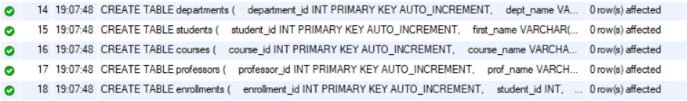

---

## 3. Constraints Implemented

The required constraints were implemented while creating the tables.

### Constraints Used

| Constraint | Purpose |
|------------|---------|
| PRIMARY KEY | Uniquely identifies each record |
| AUTO_INCREMENT | Automatically generates unique IDs |
| NOT NULL | Prevents NULL values in mandatory fields |
| UNIQUE | Prevents duplicate values in email and course code columns |
| FOREIGN KEY | Maintains referential integrity between related tables |

### Output

The constraints can be verified using:

```sql
SHOW CREATE TABLE students;
SHOW CREATE TABLE courses;
SHOW CREATE TABLE professors;
SHOW CREATE TABLE enrollments;
```

**Output**

**Students Table Constraints**
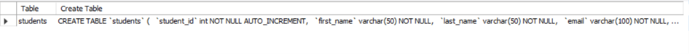

**Courses Table Constraints**
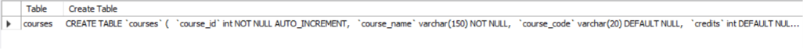

**Professors Table Constraints**
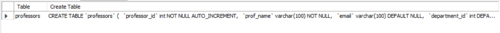

**Enrollments Table Constraints**
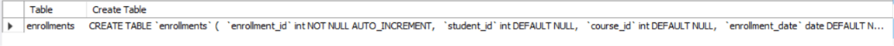

---

## 4. Table Relationships

The following foreign key relationships were established:

| Parent Table | Child Table | Foreign Key |
|--------------|-------------|-------------|
| departments | students | department_id |
| departments | courses | department_id |
| departments | professors | department_id |
| students | enrollments | student_id |
| courses | enrollments | course_id |

These relationships ensure referential integrity between the tables.

### Output

The foreign key relationships can be verified using:

```sql
SHOW CREATE TABLE students;
SHOW CREATE TABLE courses;
SHOW CREATE TABLE professors;
SHOW CREATE TABLE enrollments;
```

**Output**


---

## 5. Verify Table Creation

Verify that all tables were created successfully.

### SQL Commands

```sql
SHOW TABLES;
```

```sql
DESCRIBE departments;
DESCRIBE students;
DESCRIBE courses;
DESCRIBE professors;
DESCRIBE enrollments;
```

### Output

**Show Tables Output**
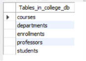

**Describe Departments Output**
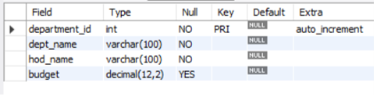

**Describe Students Output**
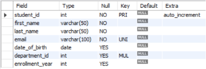

**Describe Courses Output**
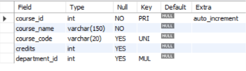

**Describe Professors Output**
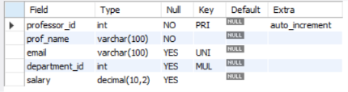

**Describe Enrollments Output**
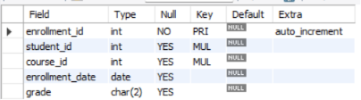

---
