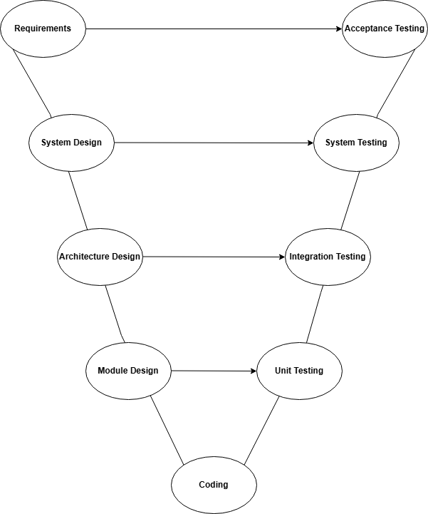

# Hands-On 2 – SDLC vs TDLC: V-Model & Agile QA Integration

## Task 1: V-Model Mapping

### 9. V-Model Diagram



The V-Model shows that every development phase has a corresponding testing phase. Test planning begins during the development phases instead of waiting until coding is complete.

---

### 10. SDLC ↔ TDLC Mapping and Test Artifacts

| SDLC Phase | Corresponding TDLC Phase | Test Artifact Produced |
|------------|--------------------------|------------------------|
| Requirements | Acceptance Testing | Acceptance Test Plan, Acceptance Test Cases |
| System Design | System Testing | System Test Plan, System Test Cases |
| Architecture Design | Integration Testing | Integration Test Plan, Integration Test Cases |
| Module Design | Unit Testing | Unit Test Cases, Unit Test Plan |
| Coding | Test Execution | Executed Test Cases, Defect Reports |

---

### 11. Entry and Exit Criteria

#### Unit Testing

**Entry Criteria**
- Module is developed.
- Code is compiled successfully.
- Unit test cases are prepared.

**Exit Criteria**
- All unit test cases executed.
- No critical defects remain.
- Code passes unit testing.

---

#### Integration Testing

**Entry Criteria**
- Individual modules pass unit testing.
- Modules are integrated.
- Integration test cases are ready.

**Exit Criteria**
- Module interactions work correctly.
- No major integration defects remain.
- Integration test cases are completed.

---

#### System Testing

**Entry Criteria**
- Complete application is deployed in the test environment.
- System test cases are prepared.
- Integration testing is completed.

**Exit Criteria**
- All planned system test cases are executed.
- No Critical or High severity defects remain open.
- Application satisfies functional requirements.

---

#### Acceptance Testing (UAT)

**Entry Criteria**
- System testing is completed.
- Application is stable.
- Client or end users are available.

**Exit Criteria**
- Users approve the application.
- Business requirements are satisfied.
- Application is accepted for deployment.

---

### 12. Early QA Engagement in the Course Management API

#### 1. Requirements Review

QA reviews the requirements before development begins to identify missing or ambiguous requirements, such as validation rules for course credits or duplicate course codes.

#### 2. Design Review

QA reviews the API endpoints, request/response formats, and database design to identify potential testing challenges and prepare test cases early.

---

# Task 2: Agile QA and Shift-Left Testing

## 13. Problems with Waterfall Testing

In the Waterfall model, testing begins only after development is completed.

### Problem 1: Late Bug Detection

If a major issue is found after development, fixing it becomes expensive and time-consuming.

### Problem 2: Inefficiency

Testing team remains idle until the development team completeles the entire project, this process is inefficient.

### Problem 3: Project Delays

Critical defects discovered during testing can delay deployment because multiple features may require rework.

---

## 14. QA Role in Agile Ceremonies

### Sprint Planning

- Understand user stories.
- Define acceptance criteria.
- Estimate testing effort.
- Plan test cases.

---

### Daily Standup

- Share testing progress.
- Report blocked issues.
- Discuss newly discovered defects.
- Coordinate with developers.

---

### Sprint Review

- Verify completed user stories.
- Test demonstrated features.
- Confirm acceptance criteria are satisfied.
- Provide feedback.

---

### Sprint Retrospective

- Discuss testing challenges.
- Suggest process improvements.
- Identify ways to reduce defects in future sprints.

---

## 15. Shift-Left Testing Practices

### a) Review Requirements for Testability

QA reviews requirements before development starts to ensure they are complete, clear, and testable.

**Course Management API Example:**
Verify that requirements clearly define valid credit ranges and duplicate course handling.

---

### b) Write Test Cases Before Coding (TDD/BDD)

QA prepares test cases before developers begin implementation.

**Course Management API Example:**
Write test cases for creating courses, invalid inputs, and duplicate course codes before implementing the API.

---

### c) Static Code Analysis

Analyze source code without executing it to detect coding issues, security vulnerabilities, and code quality problems.

**Course Management API Example:**
Run static analysis tools to detect unused variables, coding standard violations, or potential security issues.

---

### d) API Contract Testing Before Integration

Verify that API request and response formats match the agreed contract before integrating with other components.

**Course Management API Example:**
Ensure `POST /api/courses/` accepts the required fields and returns the expected JSON structure before frontend integration.

---

## 16. Acceptance Criteria (Given-When-Then)

### Scenario 1 – Happy Path

```gherkin
Given the college admin is logged in
When the admin creates a course with valid details
Then the course should be created successfully
And a "201 Created" response should be returned
```

---

### Scenario 2 – Duplicate Course Code

```gherkin
Given a course with code "CS101" already exists
When the admin creates another course with the same code
Then the system should reject the request
And an appropriate error message should be displayed
```

---

### Scenario 3 – Missing Required Fields

```gherkin
Given the college admin is creating a new course
When the required course name is left empty
Then the system should reject the request
And a validation error message should be returned
```

---
